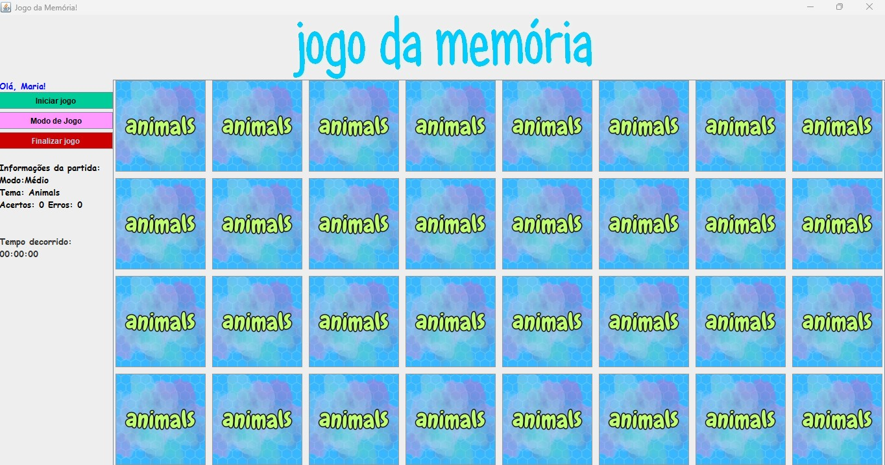
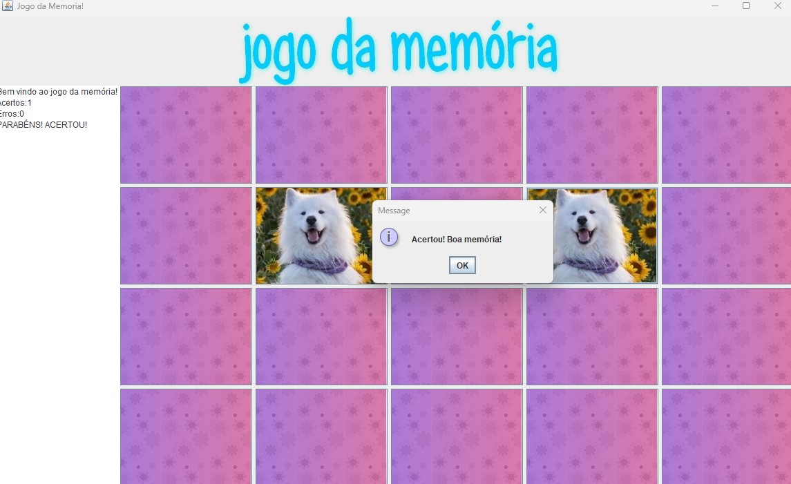

# Memory Game
This project was first developed during my technician informatics course, at CEFET-MG. I used Java as a programming language to create this game.

## How it works
The game has a number of unrevealed cards (which may vary according to the selected game mode); the main goal is to find an identical card, pair to pair. On the left side, you will find a counter of mistakes and hits.  Once all the cards have been revealed, the game is finished. After that, the player can opt to start a new game, change the game mode and/or theme, or finish the application.

## Take a look...
You can see a demonstration of the project running in the video below. To watch it, click on the image below. (The english version of the same demonstration will be available soon!)  

2024, August 13th - UPDATES  

All the game modes are now completely implemented. The images above show how the game window looks like right now. The user is now able to choose a mode and a theme, which results in 12 different ways to play.
- Modes: Easy (12 cards), Medium (32 cards), Hard (40 cards), Time Challenge (32 cards + game time limited to 60 seconds).
Each mode allows 3 themes, as following: 
- Animals, Food, Objects.

## Next steps 
The code was made in 2013 when I was a young programmer. I have not refactored or improved the code since then. I intend to make this little project better, and implement the following features:
_____UPDATE______ (August 9th - 2024)  

I have been working on refactoring, improvements, and new features since I first uploaded this project to GitHub. Below I described the current state of each feature intended: 
- More than one mode to play (Easy / Medium / Hard / Levels) -> The class "Graphic.java" is already able to be extended by other classes which will represent each mode to play. Also, a new JFrame was needed for the user to select the mode, which has already been implemented.
- Cronometer to make the game more dynamic -> The chronometer is already functional through an instance of GameTimer (GameTimer.java). Right now, this object can start, stop, and reset the time count. The time countdown has been implemented in CountdownTimer.java, which class extends GameTimer. In the Time Challenge (PT-BR: Contra o tempo) the player needs to find all the pairs within 60 seconds. Also, some pairs have special effects. More will be described inside the Time Challenge folder.
- Different themes for the cards (the current theme is "Animals"). -> The game has now three complete themes to be played.

## Be free to suggest
I invite you to open an issue and tell me what else I can implement to make this game funnier! :-) 
Soon I will be implementing more features.

## Do you want to play?
Feel free to clone this repo and play the game! Have fun. 
 

