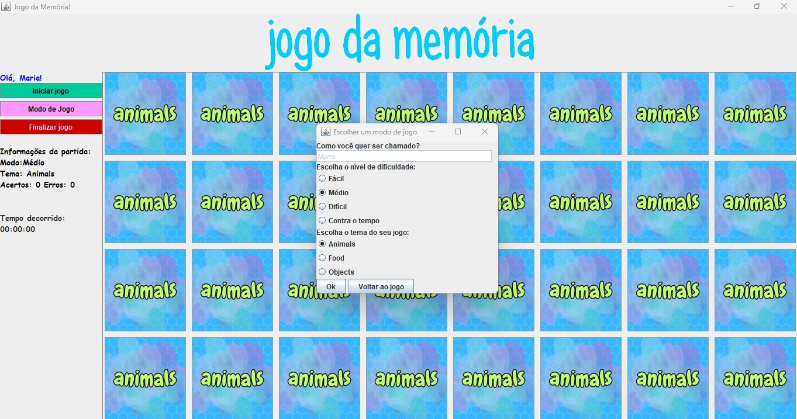

# Memory Game
This project was first developed during my technician informatics course, at CEFET-MG. I used Java as a programming language to create this game.

## How it works
The game has 20 unrevealed cards; the main goal is to find an identical card, pair to pair. On the left side, you will find a counter of mistakes and hits.  Once all the cards have been revealed, the game is finished (and the window is closed).

## Take a look...
2024, August 13th - UPDATES  

All the game modes are now completely implemented. The images above show how the game window looks like right now. The user is now able to choose a mode and a theme, which results in 12 different ways to play.
- Modes: Easy (12 cards), Medium (32 cards), Hard (40 cards), Time Challenge (32 cards + game time limited to 60 seconds).
Each mode allows 3 themes, as following: 
- Animals, Food, Objects.

## Next steps
The code was made in 2013 when I was a young programmer. I have not refactored or improved the code since then. I intend to make this little project better, and implement the following features:
- More than one mode to play (Easy / Medium / Hard / Levels)
- Cronometer to make the game more dynamic, and a maximum number of attempts (losing a "life" when the user cannot solve the memory game in time).
- Persistence of some user information, such as one's name and performance.
- Different themes for the cards (the current theme is "Animals").

## Be free to suggest
I invite you to open an issue and tell me what else I can implement to make this game funnier! :-) 
Soon I will be implementing more features.

## Do you want to play?
Feel free to clone this repo and play the game! Have fun. 
 

